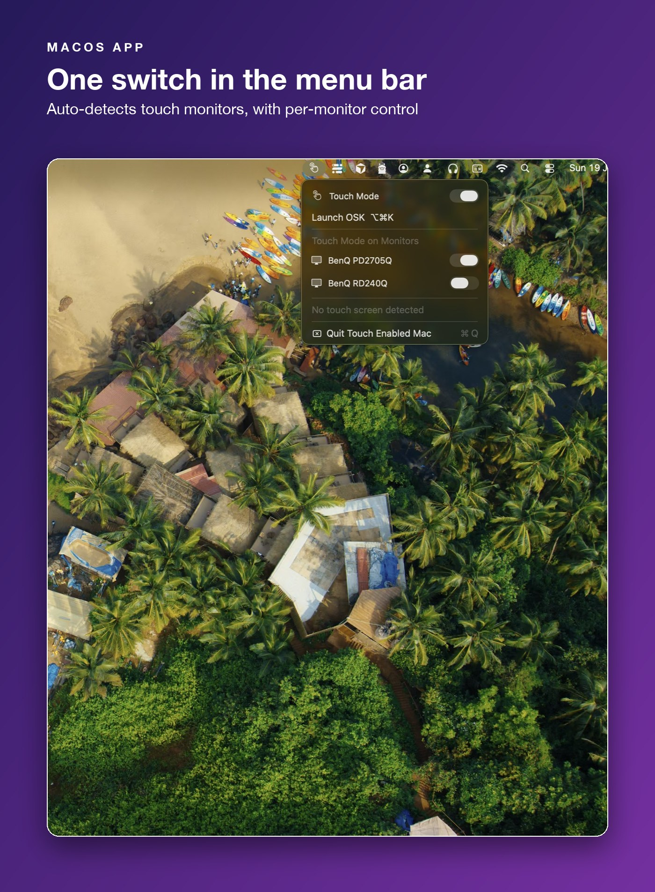
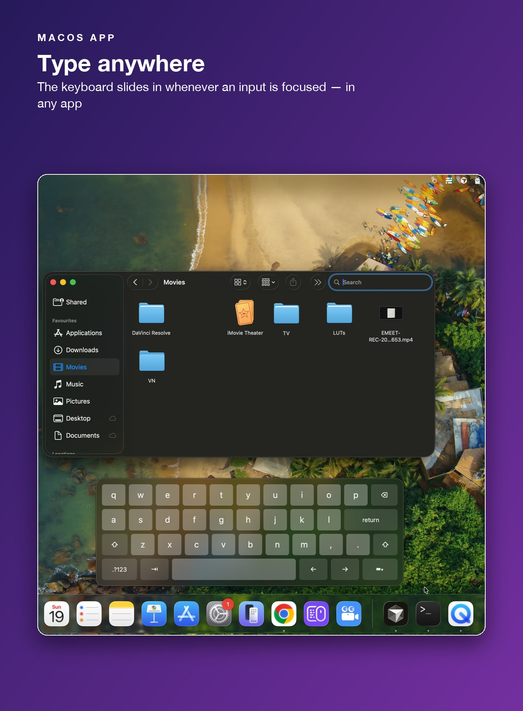
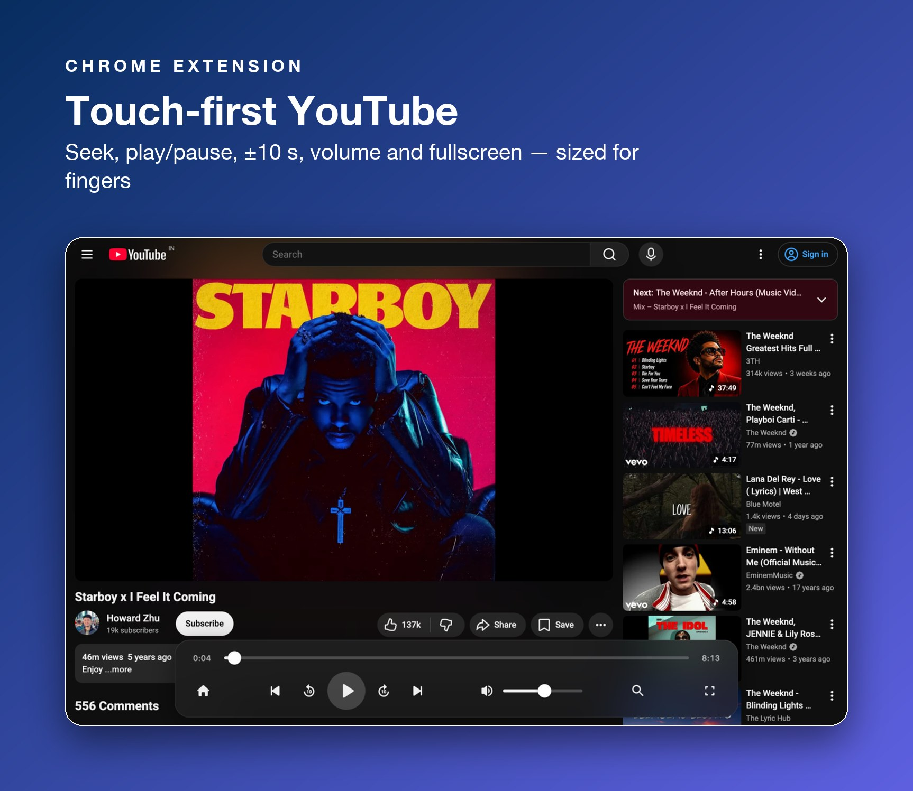
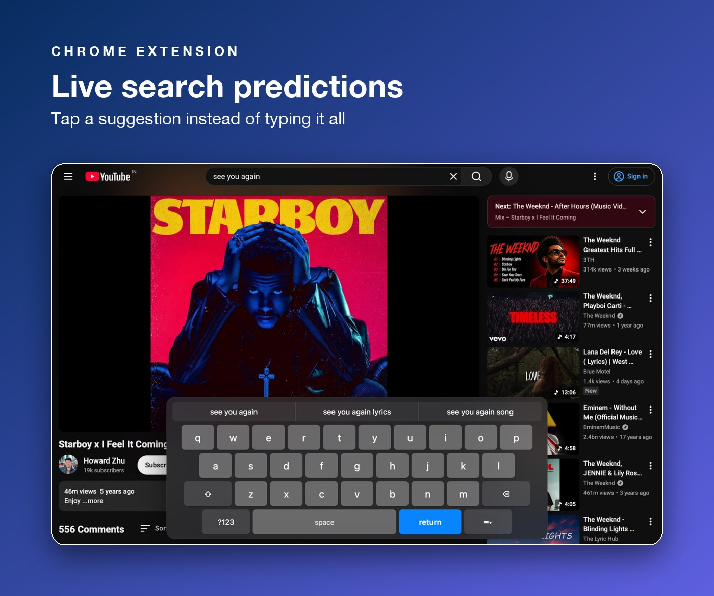
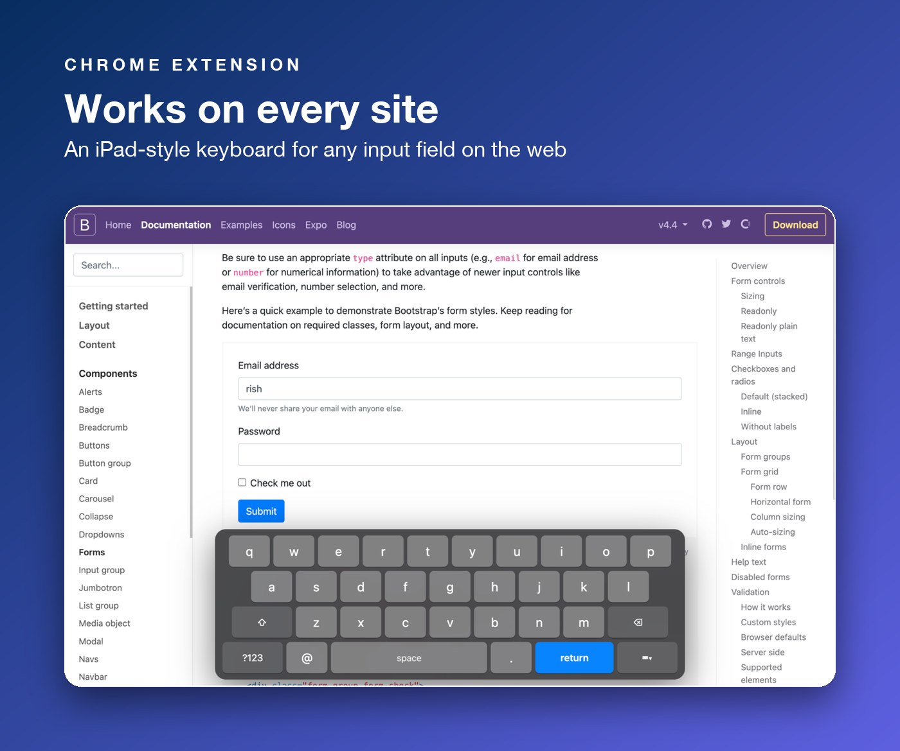

# Touch Enabled Mac

**macOS doesn't support touch screens — this project fixes that.**

Plug a touch monitor into a Mac and you can tap to click, but that's where it
ends: no scroll gestures, no on-screen keyboard, no touch-friendly controls.
Touch Enabled Mac has one objective: **give your Mac a smoother touch-screen
experience** — natural swipe scrolling, an iPad-style keyboard that appears
when you need it, and big touch targets where they matter.

It comes in two parts that work independently or together:

- **macOS app** — system-wide touch support: **two-finger swipe scrolling
  (horizontal and vertical)** on your touch monitor, and an on-screen keyboard
  that slides in automatically **whenever you focus an input box in any Mac
  application** — Finder, Terminal, Slack, anything.
- **Chrome extension** — a smoother touch *browsing* experience:
  **touch-friendly media controls on YouTube** (play/pause, prev/next, ±10 s,
  volume, seek) and an **on-screen keyboard for any input field in the
  browser**, on any website.

## Download

| Component | Get it |
| --- | --- |
| **macOS app** (installer package) | [Touch-Enabled-Mac-1.0.0.pkg](https://github.com/rishav00a/touch_enabled_mac/releases/download/v1.0.0/Touch-Enabled-Mac-1.0.0.pkg) |
| **macOS app** (disk image) | [Touch-Enabled-Mac-1.0.0.dmg](https://github.com/rishav00a/touch_enabled_mac/releases/download/v1.0.0/Touch-Enabled-Mac-1.0.0.dmg) |
| **Chrome extension** | [Chrome Web Store — TE Mac](https://chromewebstore.google.com/detail/te-mac-%E2%80%94-touch-enabled-ma/iggpbelenecgchleaodllbfplfjiabdo) (or [te-mac-chrome-extension-1.3.0.zip](https://github.com/rishav00a/touch_enabled_mac/releases/download/v1.0.0/te-mac-chrome-extension-1.3.0.zip) for manual install) |

All installers are also on the [Releases page](https://github.com/rishav00a/touch_enabled_mac/releases).

**macOS app:** run the `.pkg` (or open the `.dmg` and drag the app to
Applications). The app is ad-hoc signed, so on first open right-click →
**Open** → **Open**, then grant the **Accessibility** and **Input Monitoring**
permissions it asks for — they're what let it watch input focus and read
two-finger gestures.

**Chrome extension:** install from the
[Chrome Web Store](https://chromewebstore.google.com/detail/te-mac-%E2%80%94-touch-enabled-ma/iggpbelenecgchleaodllbfplfjiabdo)
(recommended), or manually: unzip the release zip, then `chrome://extensions`
→ Developer mode → **Load unpacked** → select the folder.

## What's in this repo

| Folder | What it is |
| --- | --- |
| [`touch_enabled_mac_macos_app/`](touch_enabled_mac_macos_app/) | Native macOS app (Swift): two-finger swipe scrolling + system-wide on-screen keyboard that works in every application. Ships as DMG/PKG. |
| [`touch_enabled_mac_chrome_extension/`](touch_enabled_mac_chrome_extension/) | Chrome extension (Manifest V3): touch media controls on YouTube + iPadOS-style on-screen keyboard for any input field on any site. |

Each works on its own, but **install both for the best experience** — smooth,
consistent touch across every native Mac app *and* everything you do in the
browser.

## Features

### macOS app

- **Two-finger swipe scrolling** — macOS only tracks a touch screen's first
  finger; the app reads the monitor's raw touch data and turns two-finger
  swipes into natural-direction scrolling, **both horizontal and vertical**.
- **Keyboard on focus, in every app** — focus any input box in any macOS
  application and the iPad-style keyboard slides in on that monitor; it slides
  away when focus leaves, like iPadOS.
- **Touch-screen auto-detection** — touch mode arms itself when a touch
  monitor is detected, with per-monitor switches and a menu-bar toggle.
- **Launch on demand** — bring the keyboard up any time with ⌥⌘K.

### Chrome extension

- **Touch media controls on YouTube** — a floating control bar with big touch
  targets: play/pause, previous/next, ±10 s, volume, and seeking.
- **On-screen keyboard for any input field** — works on any website; types
  through browser editing commands so React/Vue/Angular inputs and strict
  sites (Google, YouTube) update correctly.
- **Word & search predictions** — word completions above the keyboard, live
  YouTube search suggestions while typing in the search box.
- **Auto-detection + toolbar toggle** — enables itself when a touch screen is
  detected (including monitors whose drivers don't advertise touch); one tap
  on the toolbar icon overrides it any time.

## Screenshots

### macOS app — touch everywhere on the system

<p>
  
  
</p>

### Chrome extension — touch-friendly browsing



<p>
  
  
</p>

## Building from source

**macOS app** — requires only the Xcode Command Line Tools:

```sh
cd touch_enabled_mac_macos_app && ./build.sh   # produces dist/*.dmg and dist/*.pkg
```

**Chrome extension** — no build needed; load
`touch_enabled_mac_chrome_extension/` unpacked, or zip it per
[`store-assets/PUBLISHING.md`](touch_enabled_mac_chrome_extension/store-assets/PUBLISHING.md).

## Privacy

No accounts, no analytics, no tracking. The only data that ever leaves the
browser is the text you're currently typing, sent to two suggestion APIs
(word predictions and YouTube search suggestions). Full policy:
[PRIVACY.md](PRIVACY.md).

## Support this project

If Touch Enabled Mac makes your touch-screen Mac nicer to use, you can

[](https://ko-fi.com/Q3Q223I16Z)
## License

MIT © [rishav00a](https://github.com/rishav00a)
